# Роадмап

Роадмап построен как DAG (направленный ациклический граф) задач. В начале документа — общий граф зависимостей. Далее — плоский список задач в топологическом порядке с описаниями.

## Условные обозначения

- **Инфраструктура (I-N)** — работы по инфраструктуре: кластер, БД, шина, CI/CD, наблюдаемость. На графе — голубые узлы.
- **Функции (F-N)** — работы по функциональности системы (API + UI + бизнес-логика сервисов). На графе — зелёные узлы.
- **Дизайн (D-N)** — работы по дизайну: дизайн-система (токены, типография, иконки, базовые компоненты) и макеты экранов/виджетов. На графе — розовые узлы. Дизайн-задачи предшествуют соответствующим UI-функциональным задачам.
- **Блокеры** — задача не может быть начата, пока не завершены её блокеры. Параллельные задачи могут идти одновременно.
- **Заглушки** — допустимо реализовать временную упрощённую версию, если это позволяет разблокировать следующие задачи. Заглушка снимается, когда блокирующая задача завершена.

## Граф зависимостей

```mermaid
graph TD
    classDef infra fill:#dae8fc,stroke:#6c8ebf,color:#000
    classDef func fill:#d5e8d4,stroke:#82b366,color:#000
    classDef design fill:#f8cecc,stroke:#b85450,color:#000

    subgraph INFRA [Инфраструктура]
        I1[I-1<br/>Monorepo + GitHub Actions CI]
        I2[I-2<br/>K8s cluster]
        I3[I-3<br/>Nginx Ingress + TLS]
        I4[I-4<br/>Container Registry]
        I5[I-5<br/>Helm шаблон сервиса]
        I6[I-6<br/>PostgreSQL instances]
        I7[I-7<br/>Citus workspace]
        I8[I-8<br/>Citus events]
        I9[I-9<br/>Citus automations]
        I10[I-10<br/>Kafka]
        I11[I-11<br/>Redis]
        I12[I-12<br/>S3 storage]
        I13[I-13<br/>Prometheus + Grafana]
        I14[I-14<br/>Loki + Promtail]
        I15[I-15<br/>Sentry]
        I16[I-16<br/>Go service template]
        I17[I-17<br/>gRPC + proto codegen]
        I18[I-18<br/>Outbox relay]
        I19[I-19<br/>Nginx API Gateway]
        I20[I-20<br/>Docker Compose dev env]
    end

    subgraph DESIGN [Дизайн]
        D1[D-1<br/>Tokens colors]
        D2[D-2<br/>Typography + fonts]
        D3[D-3<br/>Icons set]
        D4[D-4<br/>Base components]
        D5[D-5<br/>Auth screens]
        D6[D-6<br/>Profile screen]
        D7[D-7<br/>Tasks list screen]
        D8[D-8<br/>Task card screen]
        D9[D-9<br/>Projects list]
        D10[D-10<br/>Project card]
        D11[D-11<br/>Teams list]
        D12[D-12<br/>Team card]
        D13[D-13<br/>Automation screen]
        D14[D-14<br/>Events feed]
        D15[D-15<br/>Tariffs screen]
        D16[D-16<br/>Blocked entities]
        D17[D-17<br/>Inbox invitations]
        D18[D-18<br/>Cross-screen widgets]
        D19[D-19<br/>Docs landing]
    end

    subgraph IDENTITY [identity-service]
        F1[F-1<br/>users + auth]
        F2[F-2<br/>PAT CRUD + ValidatePAT]
        F3[F-3<br/>Gateway PAT-validation]
        F4[F-4<br/>Email verification]
        F5[F-5<br/>Password reset]
        F6[F-6<br/>Profile + user search]
    end

    subgraph WORKSPACE [workspace-service]
        F7[F-7<br/>users_cache consumer]
        F8[F-8<br/>Projects CRUD]
        F9[F-9<br/>Project members user]
        F10[F-10<br/>Project invitations user]
        F11[F-11<br/>Project ownership]
        F12[F-12<br/>Teams CRUD]
        F13[F-13<br/>Team members + admins]
        F14[F-14<br/>Team invitations]
        F15[F-15<br/>Team ownership]
        F16[F-16<br/>Project members team]
        F17[F-17<br/>Project invitations team]
        F18[F-18<br/>Tasks CRUD]
        F19[F-19<br/>Task attachments to projects]
        F20[F-20<br/>Task blockers]
        F21[F-21<br/>Task direct access]
        F22[F-22<br/>Rights calculation union]
        F23[F-23<br/>Task lifecycle rules]
        F24[F-24<br/>Project + team lifecycle]
        F25[F-25<br/>R-7 share limitation]
        F26[F-26<br/>RSQL parser]
        F27[F-27<br/>GET /tasks with filter]
        F28[F-28<br/>Bulk operations]
        F29[F-29<br/>CSV import]
        F30[F-30<br/>Project secrets]
    end

    subgraph EVENTS [events-service]
        F31[F-31<br/>Event consumer + storage]
        F32[F-32<br/>GET /events]
    end

    subgraph AUTOMATIONS [automations-service]
        F33[F-33<br/>Automations CRUD gRPC]
        F34[F-34<br/>Facade in workspace]
        F35[F-35<br/>tasks_cache consumer]
        F36[F-36<br/>Event trigger + RSQL + template]
        F37[F-37<br/>HTTP call retry + auto-disable]
        F38[F-38<br/>Runs history]
    end

    subgraph BILLING [billing-service]
        F39[F-39<br/>Subscriptions schema]
        F40[F-40<br/>Usage counters]
        F41[F-41<br/>gRPC CheckTariffLimit]
        F42[F-42<br/>Tariff read API]
        F43[F-43<br/>YuKassa integration]
        F44[F-44<br/>Upgrade + downgrade]
        F45[F-45<br/>Bank of days]
        F46[F-46<br/>Enterprise slots]
        F47[F-47<br/>Entity blocking]
        F48[F-48<br/>Team freezing in project]
        F49[F-49<br/>Workspace apply blocking]
    end

    subgraph FILES [files-service]
        F50[F-50<br/>Upload + S3]
        F51[F-51<br/>MIME + quota]
        F52[F-52<br/>Download with rights]
        F53[F-53<br/>Orphan cleanup]
    end

    subgraph MANAGED [managed users]
        F54[F-54<br/>User schema for managed]
        F55[F-55<br/>Managed CRUD]
        F56[F-56<br/>Deactivate / reactivate]
        F57[F-57<br/>User deletion cascade]
        F58[F-58<br/>Owner = parent rule]
        F59[F-59<br/>Shared tariff pool]
    end

    subgraph FRONTEND_INFRA [Frontend инфраструктура]
        F74[F-74<br/>Angular workspace + Vite + Docker]
        F75[F-75<br/>OpenAPI codegen pipeline]
        F76[F-76<br/>Zod schemas integration]
        F77[F-77<br/>Design tokens in code]
        F78[F-78<br/>Base UI components lib]
        F79[F-79<br/>Milkdown editor lib]
        F80[F-80<br/>Shared widgets lib]
    end

    subgraph APP [Приложение app]
        F60[F-60<br/>App shell + auth]
        F61[F-61<br/>Profile + PAT]
        F62[F-62<br/>Tariffs screens]
        F63[F-63<br/>Tasks screens]
        F64[F-64<br/>Bulk ops UI]
        F65[F-65<br/>Projects screens]
        F66[F-66<br/>CSV import UI]
        F67[F-67<br/>Teams screens]
        F68[F-68<br/>Automations UI]
        F69[F-69<br/>Events feed UI]
        F70[F-70<br/>Invitations UI]
        F71[F-71<br/>Managed users UI]
    end

    subgraph DOCS [Документация docs + API]
        F81[F-81<br/>Docs app skeleton]
        F82[F-82<br/>OpenAPI pages autogeneration]
        F83[F-83<br/>Docs content + templates]
        F72[F-72<br/>OpenAPI spec publication]
        F73[F-73<br/>Docs deploy pipeline]
    end

    I1 --> I4
    I1 --> I16
    I1 --> I17
    I2 --> I3
    I2 --> I6
    I2 --> I7
    I2 --> I8
    I2 --> I9
    I2 --> I10
    I2 --> I11
    I2 --> I12
    I2 --> I13
    I2 --> I14
    I2 --> I15
    I3 --> I5
    I4 --> I5
    I5 --> I16
    I5 --> I19
    I13 --> I16
    I14 --> I16
    I15 --> I16
    I6 --> I16
    I17 --> F2
    I10 --> I18
    I16 --> I18
    I1 --> I20
    I6 --> I20
    I10 --> I20

    I3 --> I19
    I16 --> F1
    I6 --> F1
    I19 --> F1
    F1 --> F2
    F2 --> F3
    I11 --> F3
    F1 --> F4
    I18 --> F4
    F1 --> F5
    F1 --> F6

    I7 --> F7
    I10 --> F7
    I18 --> F7
    F3 --> F7
    F7 --> F8
    F8 --> F9
    F9 --> F10
    F8 --> F11
    F7 --> F12
    F12 --> F13
    F13 --> F14
    F12 --> F15
    F9 --> F16
    F13 --> F16
    F16 --> F17
    F7 --> F18
    F18 --> F19
    F8 --> F19
    F18 --> F20
    F18 --> F21
    F19 --> F22
    F21 --> F22
    F16 --> F22
    F19 --> F23
    F21 --> F23
    F9 --> F24
    F13 --> F24
    F21 --> F25
    F22 --> F25
    F18 --> F26
    F22 --> F27
    F26 --> F27
    F27 --> F28
    F19 --> F29
    F8 --> F30

    I8 --> F31
    I10 --> F31
    F31 --> F32
    F22 --> F32

    I9 --> F33
    I17 --> F33
    F8 --> F33
    F33 --> F34
    F9 --> F34
    F33 --> F35
    F18 --> F35
    F35 --> F36
    F26 --> F36
    F30 --> F36
    F36 --> F37
    F37 --> F38

    I6 --> F39
    F39 --> F40
    F18 --> F40
    F8 --> F40
    F12 --> F40
    F33 --> F40
    F39 --> F41
    F40 --> F42
    F39 --> F43
    F43 --> F44
    F41 --> F44
    F44 --> F45
    F44 --> F46
    F40 --> F47
    F41 --> F47
    F18 --> F47
    F47 --> F48
    F16 --> F48
    F47 --> F49

    I12 --> F50
    I6 --> F50
    F50 --> F51
    F41 --> F51
    F50 --> F52
    F22 --> F52
    F50 --> F53
    F22 --> F53

    F1 --> F54
    F54 --> F55
    F4 --> F55
    F41 --> F55
    F55 --> F56
    F2 --> F56
    F55 --> F57
    F6 --> F57
    F8 --> F57
    F12 --> F57
    F18 --> F57
    F50 --> F57
    F55 --> F58
    F8 --> F58
    F12 --> F58
    F58 --> F59
    F40 --> F59

    D1 --> D4
    D2 --> D4
    D3 --> D4
    D4 --> D5
    D4 --> D6
    D4 --> D7
    D4 --> D8
    D4 --> D9
    D4 --> D10
    D4 --> D11
    D4 --> D12
    D4 --> D13
    D4 --> D14
    D4 --> D15
    D4 --> D16
    D4 --> D17
    D4 --> D18
    D4 --> D19

    I1 --> F74
    F74 --> F77
    D1 --> F77
    D2 --> F77
    D3 --> F77
    F74 --> F78
    F77 --> F78
    D4 --> F78
    F74 --> F75
    F72 --> F75
    F75 --> F76
    F74 --> F79
    F78 --> F79
    F78 --> F80
    D18 --> F80

    F74 --> F60
    F3 --> F60
    F76 --> F60
    F78 --> F60
    D5 --> F60
    F60 --> F61
    F6 --> F61
    F2 --> F61
    D6 --> F61
    F60 --> F62
    F42 --> F62
    F44 --> F62
    D15 --> F62
    D16 --> F62
    F60 --> F63
    F22 --> F63
    F27 --> F63
    F79 --> F63
    F80 --> F63
    D7 --> F63
    D8 --> F63
    F63 --> F64
    F28 --> F64
    F60 --> F65
    F10 --> F65
    F11 --> F65
    F80 --> F65
    D9 --> F65
    D10 --> F65
    F65 --> F66
    F29 --> F66
    F60 --> F67
    F14 --> F67
    F15 --> F67
    F17 --> F67
    F80 --> F67
    D11 --> F67
    D12 --> F67
    F65 --> F68
    F33 --> F68
    F80 --> F68
    D13 --> F68
    F60 --> F69
    F32 --> F69
    F80 --> F69
    D14 --> F69
    F60 --> F70
    F10 --> F70
    F14 --> F70
    F11 --> F70
    F15 --> F70
    F80 --> F70
    D17 --> F70
    F61 --> F71
    F55 --> F71

    F4 --> F72
    F8 --> F72
    F18 --> F72
    F32 --> F72
    F33 --> F72
    F42 --> F72
    F50 --> F72

    F74 --> F81
    D19 --> F81
    F81 --> F82
    F72 --> F82
    F81 --> F83
    F82 --> F83
    F83 --> F73

    class I1,I2,I3,I4,I5,I6,I7,I8,I9,I10,I11,I12,I13,I14,I15,I16,I17,I18,I19,I20 infra
    class F1,F2,F3,F4,F5,F6,F7,F8,F9,F10,F11,F12,F13,F14,F15,F16,F17,F18,F19,F20,F21,F22,F23,F24,F25,F26,F27,F28,F29,F30,F31,F32,F33,F34,F35,F36,F37,F38,F39,F40,F41,F42,F43,F44,F45,F46,F47,F48,F49,F50,F51,F52,F53,F54,F55,F56,F57,F58,F59,F60,F61,F62,F63,F64,F65,F66,F67,F68,F69,F70,F71,F72,F73,F74,F75,F76,F77,F78,F79,F80,F81,F82,F83 func
    class D1,D2,D3,D4,D5,D6,D7,D8,D9,D10,D11,D12,D13,D14,D15,D16,D17,D18,D19 design
```

---

## Список задач

Задачи упорядочены в топологическом порядке от корней графа к листьям.

### I-1. Monorepo и базовая GitHub Actions CI-заготовка

- **Тип:** инфраструктура.
- **Блокеры:** —
- **Описание:** создать monorepo-структуру (`/backend`, `/frontend`, `/contracts`, `/deploy`, `/docs-source`, `/tools`), базовые GitHub Actions workflows с job'ами lint, test, build для Go-кода и proto-файлов, общий `Makefile` для локальной разработки. Внутри `/backend` подготовить директории `services/`, `pkg/`, `api-gateway/` и `go.work`.
- **Критерии готовности:** (1) Pipeline проходит lint + unit-тесты на пустых шаблонах сервисов. (2) Path-based триггеры работают — изменение в `/backend/services/foo` запускает job только для foo. (3) README с описанием структуры и команд разработки.

### I-2. Kubernetes-кластер

- **Тип:** инфраструктура.
- **Блокеры:** —
- **Описание:** развернуть Kubernetes-кластер (managed: GKE/EKS/Yandex Managed K8s) с двумя namespace: `staging` и `production`. Настроить доступ по `kubectl` для команды разработки.
- **Критерии готовности:** (1) `kubectl get nodes` возвращает минимум 3 рабочие ноды. (2) Оба namespace созданы. (3) CI имеет ServiceAccount для deployment в staging.

### I-3. Nginx Ingress + cert-manager + TLS

- **Тип:** инфраструктура.
- **Блокеры:** I-2.
- **Описание:** установить Nginx Ingress Controller, cert-manager, создать ClusterIssuer для Let's Encrypt. Настроить wildcard-сертификат для `*.staging.example.com` и `*.example.com`.
- **Критерии готовности:** (1) Ingress-деплоймент доступен извне. (2) Тестовый сервис с Ingress-ресурсом получает валидный TLS-сертификат автоматически.

### I-4. GitHub Container Registry (ghcr.io) + шаблоны CI для Docker-сборок

- **Тип:** инфраструктура.
- **Блокеры:** I-1.
- **Описание:** настроить GitHub Container Registry (ghcr.io), включить в CI build & push образов для сервисов при изменении соответствующего пути. Тегирование образов по commit SHA и `latest` для main-ветки.
- **Критерии готовности:** (1) Push в main публикует образ в registry. (2) Базовый Go-образ (multistage Dockerfile) собран и запускается.

### I-5. Helm-шаблон типового сервиса

- **Тип:** инфраструктура.
- **Блокеры:** I-2, I-3, I-4.
- **Описание:** реализовать общий Helm-чарт для сервиса (Deployment, Service, HPA, ServiceMonitor, ConfigMap, Secret). Параметризация через values.yaml. CI-job для `helm upgrade --install`.
- **Критерии готовности:** (1) Чарт проходит `helm lint`. (2) Deploy `helloworld`-сервиса на staging успешен, сервис доступен через Ingress. (3) HPA и ServiceMonitor созданы в K8s.

### I-6. PostgreSQL-инстансы (identity, billing, files)

- **Тип:** инфраструктура.
- **Блокеры:** I-2.
- **Описание:** развернуть три managed- или self-hosted (через Zalando Operator / CloudNativePG) PostgreSQL-инстанса для identity-service, billing-service, files-service. Создать базы данных, роли, credentials. Положить connection strings в Kubernetes Secrets.
- **Критерии готовности:** (1) Каждая из трёх БД доступна из K8s-кластера. (2) Из pod в cluster-е удаётся выполнить `SELECT 1`. (3) Backup policy настроена.

### I-7. Citus-кластер для workspace-service

- **Тип:** инфраструктура.
- **Блокеры:** I-2.
- **Описание:** развернуть Citus-кластер (1 coordinator + 3 worker-nodes для начала) через Citus Community Operator или managed-решение. Создать базу `workspace`.
- **Критерии готовности:** (1) `SELECT * FROM citus_get_active_worker_nodes()` возвращает 3 ноды. (2) Создание distributed-таблицы работает. (3) Backup policy настроена.

### I-8. Citus-кластер для events-service

- **Тип:** инфраструктура.
- **Блокеры:** I-2.
- **Описание:** аналогично I-7, отдельный Citus-кластер для events-service. Настройка партицирования таблицы `events` по `created_at`.
- **Критерии готовности:** (1) Кластер работает. (2) Создание партиций автоматизировано через pg_partman или аналог.

### I-9. Citus-кластер для automations-service

- **Тип:** инфраструктура.
- **Блокеры:** I-2.
- **Описание:** аналогично I-7, отдельный Citus-кластер для automations-service.
- **Критерии готовности:** (1) Кластер работает. (2) Backup policy настроена.

### I-10. Kafka-кластер

- **Тип:** инфраструктура.
- **Блокеры:** I-2.
- **Описание:** установить Strimzi Operator, развернуть Kafka-кластер (3 брокера, KRaft-режим без Zookeeper), создать базовые топики: `user-events`, `task-events`, `project-events`, `team-events`, `automation-events`, `file-events`, `tariff-events`, `blocking-events`.
- **Критерии готовности:** (1) Kafka-кластер зелёный в Strimzi. (2) Все топики созданы с корректными настройками (партиции, replication factor). (3) Тестовое сообщение публикуется и читается.

### I-11. Redis для PAT-кеша

- **Тип:** инфраструктура.
- **Блокеры:** I-2.
- **Описание:** установить Redis (через оператор или managed), доступ из api-gateway и identity-service. Настроить persistence.
- **Критерии готовности:** (1) Redis отвечает на PING. (2) Подключение из pod'а работает.

### I-12. S3-совместимое хранилище

- **Тип:** инфраструктура.
- **Блокеры:** I-2.
- **Описание:** подключить облачное S3 или развернуть MinIO через оператор. Создать bucket'ы: `files-prod` и `files-staging`. Настроить IAM-доступ, lifecycle-политики (удаление soft-deleted файлов через 30 дней).
- **Критерии готовности:** (1) Доступ по S3-API из кластера работает. (2) Bucket-политики настроены. (3) Lifecycle-правила активны.

### I-13. Prometheus + Grafana

- **Тип:** инфраструктура.
- **Блокеры:** I-2.
- **Описание:** установить `kube-prometheus-stack`. Настроить Grafana с админ-паролем в Secret. Настроить datasource Prometheus. Импортировать базовые дашборды (K8s-ресурсы, Nginx Ingress).
- **Критерии готовности:** (1) Grafana доступна через Ingress с TLS. (2) Метрики K8s видны в Prometheus. (3) Базовый dashboard работает.

### I-14. Loki + Promtail

- **Тип:** инфраструктура.
- **Блокеры:** I-2.
- **Описание:** установить Loki и Promtail через Helm. Подключить Loki как datasource в Grafana. Настроить Promtail как DaemonSet — сбор логов всех pod'ов.
- **Критерии готовности:** (1) Логи любого pod'а доступны в Grafana через LogQL. (2) Фильтрация по label `service` работает.

### I-15. Sentry

- **Тип:** инфраструктура.
- **Блокеры:** I-2.
- **Описание:** подключить облачный Sentry или развернуть self-hosted. Получить DSN для каждого сервиса. Разместить DSN в Kubernetes Secrets.
- **Критерии готовности:** (1) Тестовое unhandled-исключение из pod попадает в Sentry с контекстом. (2) Проекты Sentry созданы для каждого сервиса.

### I-16. Go-шаблон сервиса

- **Тип:** инфраструктура.
- **Блокеры:** I-1, I-5, I-6, I-13, I-14, I-15.
- **Описание:** реализовать `/backend/pkg/service-template` — общую Go-библиотеку и пример сервиса с: запуском HTTP-сервера на Gin, интеграцией Prometheus-middleware, Sentry-инициализацией, структурированным JSON-логированием, подключением к PostgreSQL, автоматическим запуском миграций через `goose up` при старте, `healthz` и `readyz` endpoint'ами, graceful shutdown.
- **Критерии готовности:** (1) Эталонный сервис собирается, деплоится через helm и проходит `readyz`. (2) Метрики экспонируются в Prometheus. (3) Логи попадают в Loki с нужными label'ами. (4) Тестовое исключение доходит до Sentry.

### I-17. gRPC + proto codegen в CI

- **Тип:** инфраструктура.
- **Блокеры:** I-1.
- **Описание:** настроить `buf` для линта и кодогенерации `.proto`-файлов. CI-job запускает `buf generate` на изменения в `/contracts/proto`, результаты коммитятся в monorepo или собираются в vendored-каталог. Настроить gRPC-server и gRPC-client обёртки в `/backend/pkg/grpc`.
- **Критерии готовности:** (1) Эталонный `.proto` компилируется в Go-типы. (2) Пример gRPC-сервера и клиента работают через loopback. (3) CI валит pipeline при нарушениях `buf lint`.

### I-18. Outbox-relay

- **Тип:** инфраструктура.
- **Блокеры:** I-10, I-16.
- **Описание:** реализовать общую библиотеку `/backend/pkg/outbox` — запись события в outbox-таблицу в той же транзакции с доменным изменением, фоновый воркер читает outbox, публикует в Kafka, помечает как sent. Обработка ошибок, ретраи, идемпотентность при повторной публикации.
- **Критерии готовности:** (1) Эталонный сервис использует outbox, событие доходит до Kafka. (2) При недоступности Kafka события копятся в outbox без потери. (3) Unit- и integration-тесты покрывают все сценарии.

### I-19. Nginx API Gateway

- **Тип:** инфраструктура.
- **Блокеры:** I-3, I-5.
- **Описание:** развернуть Nginx-pod как api-gateway. Базовая конфигурация: TLS termination, upstream к каждому сервису, маршрутизация по URL-префиксам, rate limiting. PAT-валидация пока не включена (добавляется в F-3).
- **Критерии готовности:** (1) Gateway отвечает на `/healthz`. (2) Запрос на путь, проксируемый к существующему upstream, проходит. (3) Rate limit срабатывает при превышении конфигурированного порога.

### I-20. Docker Compose dev environment

- **Тип:** инфраструктура.
- **Блокеры:** I-1, I-6, I-10.
- **Описание:** единый `docker-compose.yml` в корне monorepo, поднимающий локальный стенд для разработки: PostgreSQL, Citus (упрощённая конфигурация 1 coordinator + 1 worker), Redis, Kafka (KRaft-режим), MinIO как S3-эмулятор. Базовые образы всех backend-сервисов и api-gateway собираются через `docker build` и запускаются с нужными env-переменными. Frontend-приложения (app и docs) — с hot-reload через Vite dev server. README с инструкцией `docker compose up` и готовым набором fixture'ов для первичного заполнения данных.
- **Критерии готовности:** (1) `docker compose up` из свежего клона поднимает все компоненты. (2) Разработчик может авторизоваться и сделать базовый сценарий через UI или curl. (3) Hot-reload работает для frontend-кода.

### D-1. Дизайн-токены: цвета

- **Тип:** дизайн.
- **Блокеры:** —
- **Описание:** спроектировать трёхуровневую иерархию цветовых токенов: (1) базовая палитра (сырые цвета, например `blue-500`, `gray-900` и т.п.), (2) семантические (`primary`, `danger`, `text-default`, `background-surface`, `border-default` и т.д. — ссылаются на базовые), (3) компонентные (`button-primary-background`, `input-border-focused` и т.д. — ссылаются на семантические). Два варианта темы: light и dark. Документ дизайн-токенов в Figma с описанием правил использования каждого уровня.
- **Критерии готовности:** (1) Все три уровня оформлены в Figma как styles / variables. (2) Light и dark варианты покрывают все семантические токены. (3) Есть guide по использованию токенов (когда брать семантический, когда компонентный).

### D-2. Дизайн-токены: типография и шрифты

- **Тип:** дизайн.
- **Блокеры:** —
- **Описание:** выбрать основной шрифт (например, Inter) и моноширинный для кода. Определить типографическую шкалу (xs/sm/base/lg/xl/2xl/3xl) с размерами, line-height, font-weight для каждого уровня. Стили заголовков, основного текста, подписей, кнопок, кода.
- **Критерии готовности:** (1) Шрифты загружены в Figma, все стили размещены как styles. (2) Примеры применения стилей. (3) Лицензионная чистота выбранных шрифтов проверена.

### D-3. Набор иконок

- **Тип:** дизайн.
- **Блокеры:** —
- **Описание:** выбрать базовую библиотеку иконок (Lucide / Heroicons / аналог), подготовить набор иконок, используемых в продукте (чтение, редактирование, удаление, статусы, фильтры, поиск, управление, тарифы, предупреждения, etc.). Добавить кастомные иконки там, где библиотечные не подходят. Единый стиль: outline или filled, толщина штриха, закругления.
- **Критерии готовности:** (1) Библиотека иконок загружена и настроена. (2) Все специфичные иконки проекта созданы. (3) Sizes — xs/sm/md/lg покрыты.

### D-4. Базовые компоненты

- **Тип:** дизайн.
- **Блокеры:** D-1, D-2, D-3.
- **Описание:** спроектировать в Figma все базовые UI-компоненты дизайн-системы: кнопки (primary/secondary/tertiary/danger, sizes, состояния loading/disabled), инпуты (text, textarea, number, email, password, search), селекты, мультиселекты, чекбоксы, радио, свитчи, модальные окна (dialog, confirmation, form), попапы, тултипы, dropdown'ы, чипы, бейджи, таблицы, avatar, алерты, тосты, skeleton-loader'ы, спиннеры, табы, аккордеоны, date picker, date-range picker. Для каждого компонента — варианты, состояния, анимации.
- **Критерии готовности:** (1) Все перечисленные компоненты оформлены в Figma как components с variants. (2) Состояния (hover, focus, active, disabled) покрыты. (3) Поддержка темы light/dark видна в комнонентах через токены.

### D-5. Макеты auth-экранов

- **Тип:** дизайн.
- **Блокеры:** D-4.
- **Описание:** макеты экранов регистрации, логина, восстановления пароля, подтверждения email (экраны 1, 2, 3, 3a из ui-spec). Обе темы.
- **Критерии готовности:** все состояния экранов проработаны в Figma (пустое состояние, валидационные ошибки, loading).

### D-6. Макет экрана профиля

- **Тип:** дизайн.
- **Блокеры:** D-4.
- **Описание:** макет экрана профиля (экран 4 из ui-spec) со всеми блоками: профиль, тариф, PAT, managed-пользователи (для обычного пользователя), «Аккаунт» для managed, удаление аккаунта.
- **Критерии готовности:** макет покрывает все блоки для обоих типов пользователей.

### D-7. Макет экрана списка задач

- **Тип:** дизайн.
- **Блокеры:** D-4.
- **Описание:** макет экрана 5 из ui-spec: панель действий, панель фильтра (с виджетом RSQL), таблица задач с пагинацией и сортировкой, модалка создания задачи, модалка массового действия.
- **Критерии готовности:** все состояния проработаны (пустой список, loading, ошибки, частичное выделение).

### D-8. Макет экрана карточки задачи

- **Тип:** дизайн.
- **Блокеры:** D-4.
- **Описание:** макет экрана 6 из ui-spec: шапка, основное содержимое (markdown-редактор через Milkdown), блоки status / assignee / tags / projects / blockers / прямые доступы, мета-информация.
- **Критерии готовности:** макет покрывает read-only и редактируемые версии для разных наборов прав пользователя.

### D-9. Макет экрана списка проектов

- **Тип:** дизайн.
- **Блокеры:** D-4.
- **Описание:** макет экрана 7 из ui-spec: фильтры, таблица проектов, модалка создания.
- **Критерии готовности:** все состояния проработаны.

### D-10. Макет экрана карточки проекта

- **Тип:** дизайн.
- **Блокеры:** D-4.
- **Описание:** макет экрана 8 из ui-spec со всеми вкладками: задачи, участники (users + teams), автоматизации, секреты. Модалки импорта, приглашения, передачи владения.
- **Критерии готовности:** все вкладки и модалки покрыты.

### D-11. Макет экрана списка команд

- **Тип:** дизайн.
- **Блокеры:** D-4.
- **Описание:** макет экрана 9 из ui-spec.
- **Критерии готовности:** все состояния проработаны.

### D-12. Макет экрана карточки команды

- **Тип:** дизайн.
- **Блокеры:** D-4.
- **Описание:** макет экрана 10 из ui-spec: шапка, таблица участников с переключателем админства, таблица pending-приглашений.
- **Критерии готовности:** состояния с pending, активированными, деактивированными участниками покрыты.

### D-13. Макет экрана автоматизации

- **Тип:** дизайн.
- **Блокеры:** D-4.
- **Описание:** макет экрана 11 из ui-spec: шапка, выбор триггера, условие (виджет RSQL), действие (HTTP-вызов с плейсхолдерами, заголовки, тело), тестирование, история срабатываний.
- **Критерии готовности:** макет покрывает создание новой, редактирование существующей, просмотр истории.

### D-14. Макет ленты событий

- **Тип:** дизайн.
- **Блокеры:** D-4.
- **Описание:** макет экрана 12 из ui-spec: панель фильтра, таблица событий, detail-view конкретного события с JSON payload.
- **Критерии готовности:** все фильтры проработаны.

### D-15. Макет экрана тарифов

- **Тип:** дизайн.
- **Блокеры:** D-4.
- **Описание:** макет экрана 13 из ui-spec: сравнительная таблица тарифов с кнопками апгрейда/даунгрейда, блок слотов Enterprise.
- **Критерии готовности:** состояния «текущий тариф», «запланирован даунгрейд», «Enterprise со слотами» покрыты.

### D-16. Макет экрана заблокированных сущностей

- **Тип:** дизайн.
- **Блокеры:** D-4.
- **Описание:** макет экрана 14 из ui-spec: секции по типам сущностей, пояснения к каждой.
- **Критерии готовности:** пустые состояния и с данными проработаны.

### D-17. Макет экрана входящих приглашений

- **Тип:** дизайн.
- **Блокеры:** D-4.
- **Описание:** макет экрана 15 из ui-spec: секции приглашений команд, проектов, передач владения. Элемент с уведомлением «ожидает решения админа команды» для приглашений команде.
- **Критерии готовности:** все типы приглашений покрыты.

### D-18. Кросс-экранные виджеты

- **Тип:** дизайн.
- **Блокеры:** D-4.
- **Описание:** макеты всех 6 кросс-экранных виджетов (поиск пользователя, поиск команды, RSQL-фильтр, выбор прав R-1..R-14, приглашения/уведомления, статус тарифа). Для RSQL-виджета — подробный дизайн подсказок автодополнения, подсветки синтаксиса, inline-ошибок, справочной панели.
- **Критерии готовности:** все виджеты покрыты во всех состояниях (пустое, заполнено, ошибка, loading).

### D-19. Лендинг-документация

- **Тип:** дизайн.
- **Блокеры:** D-4.
- **Описание:** макет лендинга-документации (отдельного приложения docs): главная страница с описанием продукта и 4 ценностными предложениями, структура навигации документации (разделы, подразделы), страница описания endpoint'а (авто-генерируется из OpenAPI), страницы «сценарии работы» с примерами вызовов, страница «первые 10 минут».
- **Критерии готовности:** все типовые страницы проработаны в Figma.

### F-1. identity-service: users + регистрация/логин/логаут/смена пароля

- **Тип:** функция.
- **Блокеры:** I-6, I-16, I-19.
- **Описание:** создать identity-service по шаблону I-16. Миграции таблицы `users` (минимальный набор: id, email, password_hash, theme, language, created_at, updated_at; поля для managed и email_verified добавляются в F-4 и F-54). Реализовать endpoint'ы `/auth/register`, `/auth/login`, `/auth/logout`, `/auth/password/change`, `PATCH /users/me`, `GET /users/me`.
- **Критерии готовности:** (1) Регистрация создаёт пользователя. (2) Логин возвращает PAT (пока как строка, полноценная модель PAT — F-2). (3) Меняется пароль. (4) Меняется тема и язык.
- **Заглушки:** на этом этапе PAT генерируется простейшим образом, полноценный CRUD PAT — в F-2. Email верифицировать не требуется (добавляется в F-4); поле `email_verified_at` пока не используется.

### F-2. identity-service: PAT CRUD + gRPC ValidatePAT

- **Тип:** функция.
- **Блокеры:** F-1, I-17.
- **Описание:** миграция таблицы `pats`. Реализовать endpoint'ы `GET /pats`, `POST /pats`, `DELETE /pats/{id}`. Реализовать gRPC-метод `ValidatePAT(token) → (user_id, parent_user_id, is_active, email_verified)`.
- **Критерии готовности:** (1) Все HTTP-endpoint'ы работают. (2) gRPC ValidatePAT возвращает корректные данные для валидного, истёкшего, отозванного и несуществующего токена.

### F-3. api-gateway: PAT-валидация через auth_request + Redis-кеш

- **Тип:** функция.
- **Блокеры:** F-2, I-11, I-19.
- **Описание:** включить в Nginx-конфигурации `auth_request` — вызов identity-service для валидации PAT. Реализовать sidecar (или модуль идентификации на Go, экспонируемый как HTTP) который делает gRPC `ValidatePAT` с кешированием в Redis (TTL 60 сек). При успешной валидации — проброс заголовков `X-User-Id`, `X-Parent-User-Id`, `X-Is-Active` в upstream.
- **Критерии готовности:** (1) Запрос без токена получает 401. (2) Запрос с валидным токеном доходит до upstream с нужными заголовками. (3) Повторный запрос с тем же токеном быстрее (из кеша).

### F-4. identity-service: подтверждение email

- **Тип:** функция.
- **Блокеры:** F-1, I-18.
- **Описание:** миграция `users` добавление `email_verified_at`, `email_verification_token`. Реализовать логику: при регистрации ставится `email_verified_at=null` и выдаётся токен; отправляется email через SMTP-клиент. Endpoint `POST /auth/email-verify` принимает токен и проставляет `email_verified_at=now()`. Логин при `email_verified_at=null` отклоняется. Публикуется событие `user.managed_email_verified` (для managed-пользователей; для обычных регистраций — `user.created`) через outbox.
- **Критерии готовности:** (1) После регистрации логин невозможен до верификации. (2) Ссылка из email активирует аккаунт. (3) Событие `user.created` с корректным payload доходит до Kafka.

### F-5. identity-service: сброс пароля

- **Тип:** функция.
- **Блокеры:** F-1.
- **Описание:** миграция `password_reset_tokens`. Endpoint'ы `POST /auth/password-reset/request` (email) и `POST /auth/password-reset/confirm` (token + new_password). Письмо с ссылкой.
- **Критерии готовности:** (1) Пользователь получает письмо с валидной ссылкой. (2) Переход по ссылке позволяет задать новый пароль. (3) Просроченный токен отклоняется.

### F-6. identity-service: профиль и поиск пользователей

- **Тип:** функция.
- **Блокеры:** F-1.
- **Описание:** `GET /users/search?q=<query>` для поиска по email (регистронезависимый LIKE). Возвращает id + email. Endpoint фильтрует деактивированных пользователей при необходимости.
- **Критерии готовности:** (1) Поиск возвращает релевантные результаты. (2) Поиск с менее чем 2 символами возвращает пустой список. (3) Лимит ответа 50.

### F-7. workspace-service: users_cache + consumer user-events

- **Тип:** функция.
- **Блокеры:** I-7, I-10, I-18, F-3.
- **Описание:** создать workspace-service по шаблону. Миграция таблицы `users_cache` (`user_id`, `email`, `is_active`, `updated_at`). Реализовать Kafka-consumer для `user-events`: при получении `user.created` / `user.updated` / `user.deleted` / `user.managed_deactivated` / `user.managed_reactivated` — применять в `users_cache`. Также реализовать bulk-synchronization: при старте сервис может отставать — предусмотреть endpoint для ручной пересинхронизации (для отладки).
- **Критерии готовности:** (1) После создания пользователя в identity запись появляется в workspace.users_cache (eventually consistent, в тестах — в течение N секунд). (2) Удаление пользователя приводит к удалению из кеша.

### F-8. workspace-service: projects CRUD

- **Тип:** функция.
- **Блокеры:** F-7.
- **Описание:** миграции `projects`. Endpoint'ы `POST /projects`, `GET /projects`, `GET /projects/{id}`, `PATCH /projects/{id}`, `DELETE /projects/{id}`. При создании создателю назначаются полные права R-1..R-14 в записи `project_members` (таблица будет в F-9, пока — stub). Публикация событий `project.created`, `project.renamed`, `project.deleted` через outbox.
- **Критерии готовности:** (1) CRUD работает. (2) События публикуются в Kafka. (3) Удалить проект может только владелец.
- **Заглушки:** до F-9 логика прав не полная — создатель имеет R-13 (удаление) по упрощённой проверке (owner_id == caller); далее проверка прав через права R-1..R-14 в F-9.

### F-9. workspace-service: project members (users) с R-1..R-14

- **Тип:** функция.
- **Блокеры:** F-8.
- **Описание:** миграции `project_members` (`project_id`, `user_id`, R-1..R-14, `joined_at`). При создании проекта автоматически создаётся запись для владельца со всеми правами. Endpoint `GET /projects/{id}/members`, `PATCH /projects/{id}/members/{user_id}`, `DELETE /projects/{id}/members/{user_id}` (требует R-10). Обновление проверки прав во всех endpoint'ах: `PATCH /projects/{id}` требует R-9, `DELETE /projects/{id}` требует R-13.
- **Критерии готовности:** (1) Права R-9, R-10, R-13 работают корректно. (2) Нельзя удалить владельца. (3) Изменение прав публикует `project.member_access_changed`.

### F-10. workspace-service: project invitations (users)

- **Тип:** функция.
- **Блокеры:** F-9.
- **Описание:** миграция `project_invitations` (с полем `invitee_user_id`). Endpoint'ы: `POST /projects/{id}/invitations` (R-10), `GET /projects/{id}/invitations`, `DELETE /projects/{id}/invitations/{invitation_id}`, `POST /invitations/projects/{invitation_id}/accept`, `POST /invitations/projects/{invitation_id}/decline`. Публикация событий `project.member_added`.
- **Критерии готовности:** (1) Полный цикл invite → accept → member работает. (2) Попытка повторного приглашения того же пользователя возвращает 409.

### F-11. workspace-service: передача владения проектом

- **Тип:** функция.
- **Блокеры:** F-8.
- **Описание:** миграция `project_ownership_transfers`. Endpoint'ы `POST /projects/{id}/ownership-transfers`, `DELETE /projects/{id}/ownership-transfers/{id}`, `POST /ownership-transfers/projects/{id}/accept`, `POST /ownership-transfers/projects/{id}/decline`. Публикация `project.owner_changed`.
- **Критерии готовности:** (1) Передача работает. (2) Новый владелец получает полный набор прав (если его не было участником); старый — сохраняет свои членства, но теряет статус владельца.

### F-12. workspace-service: teams CRUD

- **Тип:** функция.
- **Блокеры:** F-7.
- **Описание:** миграции `teams`. Endpoint'ы `POST /teams`, `GET /teams`, `GET /teams/{id}`, `PATCH /teams/{id}`, `DELETE /teams/{id}`. Публикация `team.created`, `team.renamed`, `team.deleted`.
- **Критерии готовности:** (1) CRUD работает. (2) События публикуются.

### F-13. workspace-service: team members + админство

- **Тип:** функция.
- **Блокеры:** F-12.
- **Описание:** миграции `team_members` (`is_admin`). При создании команды автоматически создаётся запись для владельца с `is_admin=true`. Endpoint'ы `GET /teams/{id}/members`, `PATCH /teams/{id}/members/{user_id}` (админство), `DELETE /teams/{id}/members/{user_id}`. Проверки прав на админские действия. Публикация `team.admin_granted`, `team.admin_revoked`, `team.member_removed`.
- **Критерии готовности:** (1) Админские действия требуют админских прав. (2) Нельзя удалить владельца. (3) Удаление последнего админа — команда удаляется автоматически.

### F-14. workspace-service: team invitations

- **Тип:** функция.
- **Блокеры:** F-13.
- **Описание:** миграция `team_invitations`. Endpoint'ы приглашений аналогично project invitations. Публикация `team.member_added`.
- **Критерии готовности:** (1) Полный цикл invite → accept работает. (2) Только админы могут приглашать.

### F-15. workspace-service: передача владения командой

- **Тип:** функция.
- **Блокеры:** F-12.
- **Описание:** миграция `team_ownership_transfers`. Endpoint'ы аналогично ownership для проекта. Новый владелец автоматически получает админство (если не имел).
- **Критерии готовности:** (1) Передача работает. (2) Новый владелец получает админство.

### F-16. workspace-service: project members (teams)

- **Тип:** функция.
- **Блокеры:** F-9, F-13.
- **Описание:** миграция `project_teams` (с R-1..R-14 и `is_frozen_in_project`). Endpoint'ы `GET /projects/{id}/team-members`, `PATCH /projects/{id}/team-members/{team_id}`, `DELETE /projects/{id}/team-members/{team_id}`.
- **Критерии готовности:** (1) Управление командами в проекте работает.

### F-17. workspace-service: project invitations (teams)

- **Тип:** функция.
- **Блокеры:** F-16.
- **Описание:** расширение `project_invitations` полем `invitee_team_id`. Поведение — приглашение принимается админом команды. Флаг `is_active` для отложенных приглашений (активируются когда лимит тарифа позволит; логика активации — в F-48).
- **Критерии готовности:** (1) Цикл invite team → accept by team admin → team-members запись работает. (2) Флаг `is_active` корректно сохраняется.

### F-18. workspace-service: tasks CRUD

- **Тип:** функция.
- **Блокеры:** F-7.
- **Описание:** миграции `tasks`. Endpoint'ы `POST /tasks`, `GET /tasks/{id}`, `PATCH /tasks/{id}`, `DELETE /tasks/{id}`. На этом этапе проверка прав упрощённая — автор задачи имеет все права, остальные — никаких. Полная модель прав — в F-22. Публикация событий `task.*`.
- **Критерии готовности:** (1) CRUD работает. (2) События публикуются.
- **Заглушки:** проверка прав = `caller_id == author_id`; полная модель в F-22.

### F-19. workspace-service: прикрепление задач к проектам

- **Тип:** функция.
- **Блокеры:** F-18, F-8.
- **Описание:** миграция `task_projects`. Endpoint'ы `POST /tasks/{id}/projects`, `DELETE /tasks/{id}/projects/{project_id}`. Проверка R-12 в проекте при прикреплении/откреплении. Публикация `task.attached_to_project`, `task.detached_from_project`.
- **Критерии готовности:** (1) Прикрепление/открепление работают. (2) R-12 проверяется.

### F-20. workspace-service: блокеры задач

- **Тип:** функция.
- **Блокеры:** F-18.
- **Описание:** миграция `task_blockers`. Endpoint `PATCH /tasks/{id}` включает поле `blocking_task_ids`, при наличии формирует diff и применяет. Публикация `task.blockers_changed`. В `GET /tasks/{id}` вычислять `blocked_task_ids` на лету.
- **Критерии готовности:** (1) Добавление/удаление блокеров работают. (2) `blocked_task_ids` корректно вычисляется. (3) Self-blocker запрещён (CHECK-constraint).

### F-21. workspace-service: прямые доступы на задачу

- **Тип:** функция.
- **Блокеры:** F-18.
- **Описание:** миграция `task_direct_accesses`. Endpoint'ы `GET /tasks/{id}/accesses`, `POST /tasks/{id}/accesses`, `PATCH /tasks/{id}/accesses/{access_id}`, `DELETE /tasks/{id}/accesses/{access_id}`. Публикация `task.access_granted`, `task.access_revoked`, `task.access_changed`.
- **Критерии готовности:** (1) CRUD работает. (2) Выдача пользователю и команде работает.
- **Заглушки:** пока без R-7 проверки «не больше, чем у себя» — полная проверка в F-25. На этом этапе может выдавать любые права.

### F-22. workspace-service: вычисление прав union

- **Тип:** функция.
- **Блокеры:** F-19, F-21, F-16.
- **Описание:** реализовать функцию `calculateUserRights(user_id, task_id) → TaskPermissions + ProjectPermissions` по правилу union из всех источников (личный прямой доступ, через команду, личный проектный, через команду в проекте). Интегрировать во все endpoint'ы tasks: проверка прав на чтение/изменение полей по соответствующим R-N. Учитывать флаги блокировок тарифом (применение заглушки — в F-49).
- **Критерии готовности:** (1) Правильное вычисление прав во всех сценариях (unit-тесты). (2) Integration test: пользователь не видит задач, к которым нет доступа. (3) Редактирование поля требует соответствующего R-N.

### F-23. workspace-service: правила жизни задачи

- **Тип:** функция.
- **Блокеры:** F-19, F-21.
- **Описание:** реализовать правило автоудаления задачи: при откреплении от последнего проекта, если нет прямых доступов с R-8 — задача удаляется. Аналогично при отзыве последнего прямого доступа с R-8, если задача не в проектах.
- **Критерии готовности:** (1) Задача автоудаляется в описанных сценариях. (2) Публикуется `task.deleted`.

### F-24. workspace-service: правила жизни проекта и команды

- **Тип:** функция.
- **Блокеры:** F-9, F-13.
- **Описание:** при удалении/потере последнего участника с R-13 в проекте — проект удаляется с каскадным удалением задач (или откреплением; согласно правилу жизни задач). Команда: при потере последнего админа — удаляется. Публикация `project.deleted`, `team.deleted`.
- **Критерии готовности:** (1) Удаление пользователей приводит к корректному применению правил. (2) Каскады работают.

### F-25. workspace-service: R-7 ограничение при выдаче

- **Тип:** функция.
- **Блокеры:** F-21, F-22.
- **Описание:** при создании или обновлении прямого доступа через `POST/PATCH /tasks/{id}/accesses` — проверять, что выдаваемые права ⊆ прав вызывающего на задачу. Нарушение — 403.
- **Критерии готовности:** (1) Пользователь без R-6 не может выдать R-6 другим. (2) Пользователь с полным набором может выдать любое подмножество.

### F-26. workspace-service: RSQL парсер и эвалюатор

- **Тип:** функция.
- **Блокеры:** F-18.
- **Описание:** реализовать парсер RSQL (операторы `==`, `!=`, `=gt=`, `=lt=`, `=ge=`, `=le=`, `=in=`, `=out=`, `;`, `,`, скобки, экранирование кавычками). Эвалюатор, трансформирующий AST в SQL WHERE-clause для задач. Поддержка всех полей (включая массивы tags/projects/blockers с перегрузкой операторов), литерала `null`, форматов дат ISO 8601 + относительных (`now-7d`). Лимиты: 4096 символов, 1000 операндов в `=in=`. Ошибки парсинга возвращают структурированный error.
- **Критерии готовности:** (1) Все операторы работают в unit-тестах. (2) Корректная работа с массивами и null. (3) Относительные даты преобразуются в абсолютные. (4) Лимиты соблюдаются. (5) Есть Go-API для использования в других местах (fallback-эвалюатор для in-memory списков для автоматизаций).

### F-27. workspace-service: GET /tasks с фильтрацией

- **Тип:** функция.
- **Блокеры:** F-22, F-26.
- **Описание:** `GET /tasks?filter=<RSQL>&cursor=...&limit=...&sort=...` возвращает задачи, доступные вызывающему, с фильтрацией и пагинацией. Проверка видимости (вызывающий имеет хотя бы одно право на задачу) — встроена в query.
- **Критерии готовности:** (1) Фильтр применяется корректно. (2) Пагинация работает. (3) Пользователь видит только доступные задачи. (4) Сортировки работают.

### F-28. workspace-service: массовые операции

- **Тип:** функция.
- **Блокеры:** F-27.
- **Описание:** `POST /tasks/bulk/by-filter` и `POST /tasks/bulk/by-ids`. Поддерживаемые операции: change_status, set_assignee, add/remove_tags, add/remove_blockers, attach/detach_project, grant/revoke_access, delete. Все транзакционно; любая ошибка — откат. Лимит 1000 задач. Детальный ответ со списком причин ошибок на каждой задаче.
- **Критерии готовности:** (1) Все операции работают. (2) Транзакционность — любая ошибка откатывает всё. (3) Лимит 1000 проверяется.

### F-29. workspace-service: CSV-импорт

- **Тип:** функция.
- **Блокеры:** F-19.
- **Описание:** `POST /projects/{id}/import` с multipart-файлом. Требует R-14. Валидация: обязательная колонка `title`, опциональные `description`/`status`/`assignee`/`tags`. Разделитель тегов `;`. Email assignee проверяется через `users_cache`. Лимит 10 000 строк / 10 МБ. Транзакционный импорт — при ошибке ничего не создаётся, возвращается отчёт ошибок по строкам.
- **Критерии готовности:** (1) Успешный импорт создаёт задачи, прикреплённые к проекту. (2) Невалидная строка валит весь импорт. (3) Проверка на `tasks_total` лимит тарифа (через gRPC в billing — пока заглушка, снимается при F-41).
- **Заглушки:** проверка лимита тарифа до F-41 — пропускать (всегда разрешать).

### F-30. workspace-service: project secrets

- **Тип:** функция.
- **Блокеры:** F-8.
- **Описание:** миграция `project_secrets` (с полем `value_encrypted` — AES-256-GCM, ключ в K8s Secret). Endpoint'ы `GET /projects/{id}/secrets` (только ключи), `PUT /projects/{id}/secrets/{key}`, `DELETE /projects/{id}/secrets/{key}`. Требует R-11.
- **Критерии готовности:** (1) Шифрование работает. (2) Значения никогда не возвращаются через API. (3) R-11 проверяется.

### F-31. events-service: consumer и хранение

- **Тип:** функция.
- **Блокеры:** I-8, I-10.
- **Описание:** создать events-service. Миграция партицированной таблицы `events`. Kafka-consumer на все событийные топики. При получении события нормализация полей, запись в `events`. Автоматическое создание новых партиций (через pg_partman или cron).
- **Критерии готовности:** (1) Любое событие из Kafka попадает в БД events. (2) Партиции автоматически создаются и старые автоматически удаляются согласно retention.

### F-32. events-service: GET /events

- **Тип:** функция.
- **Блокеры:** F-31, F-22.
- **Описание:** `GET /events?actor_id=&project_id=&task_id=&type=&from=&to=&cursor=&limit=`. Фильтрация с проверкой прав вызывающего — через gRPC в workspace-service (видит ли пользователь связанную сущность). Курсорная пагинация от новых к старым.
- **Критерии готовности:** (1) Все фильтры работают и комбинируются. (2) Пользователь видит только события, связанные с доступными ему сущностями. (3) Пагинация работает.

### F-33. automations-service: CRUD через gRPC

- **Тип:** функция.
- **Блокеры:** I-9, I-17, F-8.
- **Описание:** создать automations-service. Миграции `automations` и `automation_runs`. gRPC-методы: CreateAutomation, UpdateAutomation, GetAutomation, ListAutomations, EnableAutomation, DisableAutomation, DeleteAutomation, GetRuns. На этом этапе нет триггеров, нет выполнения — только CRUD.
- **Критерии готовности:** (1) gRPC-методы работают. (2) Данные сохраняются в Citus.

### F-34. workspace-service: facade automations

- **Тип:** функция.
- **Блокеры:** F-33, F-9.
- **Описание:** в workspace-service добавить endpoint'ы-фасады: `POST /projects/{id}/automations` и т.д. Проверка R-11 в проекте, далее gRPC-вызов в automations. Публикация `automation.enabled`, `automation.disabled`.
- **Критерии готовности:** (1) Публичный API работает и проверяет R-11. (2) Данные корректно проходят через фасад.

### F-35. automations-service: tasks_cache consumer

- **Тип:** функция.
- **Блокеры:** F-33, F-18.
- **Описание:** миграция `tasks_cache` с полями нужными для RSQL (`id`, `title`, `status`, `assignee_id`, `author_id`, `tags`, `project_ids`, `created_at`, `updated_at`). Kafka-consumer `task-events` — применяет изменения.
- **Критерии готовности:** (1) Изменения в workspace отражаются в tasks_cache с задержкой не более секунд.

### F-36. automations-service: триггеры + RSQL + шаблонизация

- **Тип:** функция.
- **Блокеры:** F-35, F-26, F-30.
- **Описание:** Kafka-consumer на все событийные топики; поиск подписанных автоматизаций; применение RSQL-условия (переиспользуем парсер из F-26, но эвалюация in-memory над `tasks_cache`); шаблонизатор `{{…}}` + `{{secrets.*}}` (секреты получаются через gRPC в workspace с кешом в памяти). На этом этапе — только формирование HTTP-запроса; исполнение — в F-37.
- **Критерии готовности:** (1) Для тестового события правильно выбирается набор автоматизаций. (2) RSQL-условие корректно применяется. (3) Шаблоны подставляются. (4) Секреты резолвятся.

### F-37. automations-service: HTTP-вызовы + ретраи + автоотключение

- **Тип:** функция.
- **Блокеры:** F-36.
- **Описание:** реализовать HTTP-клиент для вызовов автоматизации. Таймаут 30 сек. При ошибке — ретраи 1 мин → 5 мин → 15 мин (через персистентную очередь, реализованную в той же БД automations). После 10 подряд неуспешных срабатываний — `is_enabled=false`, публикация `automation.auto_disabled`. Запись каждой попытки в `automation_runs`.
- **Критерии готовности:** (1) Успешные вызовы выполняются. (2) Ретраи срабатывают корректно. (3) Автоотключение после 10 подряд неуспехов. (4) Счётчик сбрасывается при успехе.

### F-38. automations-service: GET /projects/{id}/automations/{id}/runs

- **Тип:** функция.
- **Блокеры:** F-37.
- **Описание:** фасад в workspace: `GET /projects/{id}/automations/{id}/runs`, проверка R-11, gRPC-вызов. В automations возврат истории срабатываний с фильтрами и пагинацией.
- **Критерии готовности:** (1) История доступна через публичный API.

### F-39. billing-service: subscriptions schema

- **Тип:** функция.
- **Блокеры:** I-6.
- **Описание:** создать billing-service. Миграции `subscriptions`, `subscription_bank_layers`, `subscription_history`, `payment_transactions`. При получении события `user.created` из Kafka — автоматически создавать запись `subscriptions` с `plan='free'`.
- **Критерии готовности:** (1) Новый пользователь получает запись Free в subscriptions. (2) Все таблицы созданы.

### F-40. billing-service: usage counters

- **Тип:** функция.
- **Блокеры:** F-39, F-8, F-12, F-18, F-33.
- **Описание:** миграция `usage_counters`. Kafka-consumer событий создания/удаления сущностей (`task.created/deleted`, `project.created/deleted`, `team.created/deleted`, `automation.created/deleted`). Пересчёт счётчиков: `tasks_total`, `projects_owned`, `teams_owned`, `automations_per_project`, `members_per_project`, `members_per_team` для каждого пользователя.
- **Критерии готовности:** (1) При создании задачи счётчик увеличивается. (2) При удалении — уменьшается. (3) Значения видны через `GET /tariffs/usage` (как заглушка до F-42).

### F-41. billing-service: gRPC CheckTariffLimit

- **Тип:** функция.
- **Блокеры:** F-39.
- **Описание:** gRPC-метод `CheckTariffLimit(user_id, entity_type) → (allowed, limit, used)`. Используется другими сервисами перед созданием сущности.
- **Критерии готовности:** (1) Метод возвращает корректный ответ для всех типов лимитов. (2) Поддерживает все тарифы.

### F-42. billing-service: tariff read API

- **Тип:** функция.
- **Блокеры:** F-40.
- **Описание:** публичные endpoint'ы `GET /tariffs/plans`, `GET /tariffs/subscription`, `GET /tariffs/usage`, `GET /tariffs/history`, `GET /tariffs/blocked`.
- **Критерии готовности:** (1) Все endpoint'ы возвращают корректные данные. (2) Структура ответа соответствует API-спеке.

### F-43. billing-service: ЮKassa

- **Тип:** функция.
- **Блокеры:** F-39.
- **Описание:** интеграция с ЮKassa: создание платежа, получение payment_url, webhook endpoint `POST /payments/yukassa/webhook` с верификацией подписи. При успешном платеже — обновление `payment_transactions` и запуск обработки (кто-то другой применит результат).
- **Критерии готовности:** (1) Тестовый платёж проходит через песочницу ЮKassa. (2) Webhook валидирует подпись. (3) Неверная подпись отклоняется.

### F-44. billing-service: upgrade + downgrade

- **Тип:** функция.
- **Блокеры:** F-43, F-41.
- **Описание:** endpoint'ы `POST /tariffs/upgrade`, `POST /tariffs/downgrade`, `DELETE /tariffs/downgrade`. Апгрейд: создание платежа, при успехе — смена тарифа, старый в банк. Даунгрейд: запись `planned_downgrade*` в subscriptions, применение cron-задачей при наступлении. Публикация `user.tariff_changed`.
- **Критерии готовности:** (1) Апгрейд с оплатой работает полный путь. (2) Запланированный даунгрейд применяется в срок. (3) Отмена даунгрейда работает.

### F-45. billing-service: банк дней

- **Тип:** функция.
- **Блокеры:** F-44.
- **Описание:** логика накопления слоёв банка при апгрейдах. При окончании текущего оплаченного периода — активируется верхний слой банка. Публикация `user.tariff_bank_applied`. Cron-задача проверяет наступление event'ов.
- **Критерии готовности:** (1) Множественные апгрейды накапливают слои. (2) Слои активируются в правильном порядке. (3) Банк обнуляется по мере использования.

### F-46. billing-service: слоты Enterprise

- **Тип:** функция.
- **Блокеры:** F-44.
- **Описание:** endpoint'ы `POST /tariffs/enterprise-slots`, `PATCH /tariffs/enterprise-slots`, `DELETE /tariffs/enterprise-slots/pending-decrease`. Логика докупки через ЮKassa и планового уменьшения с конца периода.
- **Критерии готовности:** (1) Докупка слотов работает. (2) Плановое уменьшение применяется в срок. (3) Отмена уменьшения работает.

### F-47. billing-service: entity blocking

- **Тип:** функция.
- **Блокеры:** F-40, F-41, F-18.
- **Описание:** при деградации тарифа/уменьшении слотов/смене владельца пересчёт лимитов и определение сверхлимитных сущностей. Публикация `*.blocked_by_tariff` / `*.unblocked_by_tariff` через outbox. Порядок блокировки: самые новые первыми; владелец проекта никогда. Автоматическая разблокировка при освобождении.
- **Критерии готовности:** (1) При деградации тарифа события блокировки публикуются. (2) Порядок корректный. (3) Разблокировка автоматическая.

### F-48. billing-service: team freezing in project

- **Тип:** функция.
- **Блокеры:** F-47, F-16.
- **Описание:** при росте команды, превышающем лимит участников проекта по тарифу — публикация `team.frozen_in_project` с указанием `project_id` и `team_id`. При нормализации — `team.unfrozen_in_project`. Логика активации отложенных team-приглашений (F-17).
- **Критерии готовности:** (1) Заморозка корректно определяется. (2) Разморозка автоматическая. (3) Отложенные приглашения активируются.

### F-49. workspace-service: apply blocking

- **Тип:** функция.
- **Блокеры:** F-47.
- **Описание:** Kafka-consumer в workspace на события `blocking-events`. При получении `task.blocked_by_tariff` — выставление `is_blocked_by_tariff=true` в `tasks`; аналогично для `project`, `team`, `project_member`, `team_member`, `automation` (через gRPC в automations). Применение флагов в проверках прав (заблокированная сущность — read-only).
- **Критерии готовности:** (1) Блокировки видны в ответах API. (2) Write-операции на заблокированных сущностях отклоняются.

### F-50. files-service: upload + S3

- **Тип:** функция.
- **Блокеры:** I-12, I-6.
- **Описание:** создать files-service. Миграция `files`. Endpoint `POST /files` (multipart, опциональные параметры `task_id` и `project_id` для определения purpose). Валидация MIME через magic bytes; белый список. Загрузка в S3 streaming'ом. Запись в `files`. Ответ с URL файла.
- **Критерии готовности:** (1) Загрузка в одну команду работает (curl -F). (2) Недопустимый MIME — 400. (3) Файл в S3 и запись в БД.
- **Заглушки:** проверка квоты до F-51 — отсутствует.

### F-51. files-service: MIME + quota

- **Тип:** функция.
- **Блокеры:** F-50, F-41.
- **Описание:** перед загрузкой — gRPC в billing `CheckTariffLimit(user_id, 'storage_bytes')`. При превышении — 422. Отдельный тип лимита `storage_bytes` добавляется в billing-service как расширение F-41 (fix-up).
- **Критерии готовности:** (1) Free пользователь не может загрузить больше 500 МБ суммарно. (2) Превышение даёт 422 с понятной ошибкой.

### F-52. files-service: download + rights check

- **Тип:** функция.
- **Блокеры:** F-50, F-22.
- **Описание:** `GET /files/{id}` для скачивания. Если у файла есть `task_id` — gRPC в workspace `CheckTaskAccess(task_id, user_id)` для проверки прав. Для `csv_import` — только владелец проекта или сам автор импорта.
- **Критерии готовности:** (1) Пользователь с доступом к задаче скачивает файл. (2) Без доступа — 403.

### F-53. files-service: orphan cleanup

- **Тип:** функция.
- **Блокеры:** F-50, F-22.
- **Описание:** Kafka-consumer на `task.deleted` — soft-delete связанных файлов. Cron-задача в files-service удаляет `csv_import`-файлы старше 30 дней. S3-lifecycle-политика физически удаляет soft-deleted файлы через 30 дней.
- **Критерии готовности:** (1) При удалении задачи её файлы помечаются is_deleted. (2) CSV-файлы автоматически чистятся. (3) S3 освобождается по lifecycle.

### F-54. identity-service: schema for managed users

- **Тип:** функция.
- **Блокеры:** F-1.
- **Описание:** миграция `users` — добавление `parent_user_id`, `is_active` (default true). Добавление constraint `parent_user_id <> id`. Обновление логина: отклонять при `is_active=false`. Обновление gRPC `ValidatePAT` — возвращать `parent_user_id` и `is_active`.
- **Критерии готовности:** (1) Миграция применяется без ошибок на существующих данных. (2) `is_active=false` блокирует логин. (3) gRPC возвращает новые поля.

### F-55. identity-service: managed-users CRUD

- **Тип:** функция.
- **Блокеры:** F-54, F-4, F-41.
- **Описание:** endpoint'ы `POST /managed-users`, `GET /managed-users`, `GET /managed-users/{id}`, `DELETE /managed-users/{id}`, `POST /managed-users/{id}/resend-verification`, `POST /managed-users/{id}/reset-password`. При создании — email-verification (переиспользует F-4), проверка уникальности email, gRPC `CheckTariffLimit(parent_id, 'managed_users')`. Управление доступно только родителю. Публикация `user.managed_created`, `user.managed_password_reset`.
- **Критерии готовности:** (1) Создание → email приходит → activation работает. (2) Email уникальность проверяется. (3) Managed не может создавать managed.

### F-56. identity-service: deactivate / reactivate

- **Тип:** функция.
- **Блокеры:** F-55, F-2.
- **Описание:** endpoint'ы `POST /managed-users/{id}/deactivate`, `POST /managed-users/{id}/reactivate`. При деактивации: `is_active=false`, все PAT managed отзываются, публикация `user.managed_deactivated` (consumer в automations выключает автоматизации managed; consumer в workspace отклоняет pending-приглашения от/к managed).
- **Критерии готовности:** (1) Деактивация/ре-активация работают. (2) Логин заблокирован. (3) Автоматизации выключены. (4) Приглашения отклонены.

### F-57. identity-service: user deletion cascade

- **Тип:** функция.
- **Блокеры:** F-55, F-6, F-8, F-12, F-18, F-50.
- **Описание:** endpoint `DELETE /users/me` и `DELETE /managed-users/{id}`. Публикация `user.deleted`. Во всех сервисах-консьюмерах (workspace, automations, billing, files) — обработка `user.deleted`: workspace каскадно удаляет проекты и команды владения (через FK ON DELETE CASCADE в своей локальной БД) и managed (через consumer cascade); в денормализованных копиях — удаление записи; ссылки в исторических полях (author, assignee, granted_by и т.д.) становятся NULL. Удаление автора в events работает через нативный ON DELETE SET NULL в FK.
- **Критерии готовности:** (1) Удаление пользователя каскадно удаляет его проекты/команды/managed/файлы. (2) Исторические ссылки становятся NULL. (3) Integration-тест проверяет полный сценарий.

### F-58. workspace-service: owner = parent rule

- **Тип:** функция.
- **Блокеры:** F-55, F-8, F-12.
- **Описание:** в endpoint'ах `POST /projects` и `POST /teams` проверять `parent_user_id` (из заголовка `X-Parent-User-Id`): если не null — owner_id = parent_user_id, membership создаётся для вызывающего с полными правами (R-1..R-14 / is_admin=true). Если `parent_user_id` = null — owner_id = user_id.
- **Критерии готовности:** (1) Managed создаёт проект — owner = родитель. (2) Managed создаёт команду — owner = родитель, managed = админ.

### F-59. billing-service: shared pool for managed

- **Тип:** функция.
- **Блокеры:** F-58, F-40.
- **Описание:** обновить пересчёт `usage_counters`: учитывать задачи, проекты, команды, автоматизации, files родителя И всех его managed в общий пул. `CheckTariffLimit` применяет лимиты родителя при запросе managed-пользователя. Тарифные endpoint'ы (апгрейд, даунгрейд, слоты) отклоняются с 403 для managed.
- **Критерии готовности:** (1) Managed не может купить тариф. (2) Создание задачи managed учитывается в лимите родителя. (3) При деградации тарифа родителя блокировки применяются ко всем сущностям общего пула.

### F-74. Angular workspace + Vite + Docker

- **Тип:** функция.
- **Блокеры:** I-1.
- **Описание:** инициализировать Angular Workspace в `frontend/` с двумя приложениями (`projects/app`, `projects/docs`) и набором пустых `libs` (`design-system`, `api-client`, `shared-widgets`, `shared-utils`, `rsql`, `markdown-editor`). Настроить сборку через Angular builder + Vite. Структура `projects/app` с директориями `pages/`, `core/`, `services/`, `components/`. Multistage Dockerfile (node build → nginx:alpine статика). Добавить frontend-компоненты в GitHub Actions с path-based триггерами (`paths:`): изменения в `frontend/projects/app` или `frontend/libs/**` собирают app; в `frontend/projects/docs` — docs.
- **Критерии готовности:** (1) `ng build app` и `ng build docs` собираются без ошибок. (2) Docker-образы обоих приложений собираются и запускаются. (3) CI автоматически собирает и деплоит оба приложения. (4) Lazy loading страниц работает (в `app` создана тестовая страница, загружается через `loadComponent`).

### F-75. OpenAPI codegen pipeline

- **Тип:** функция.
- **Блокеры:** F-74, F-72.
- **Описание:** настроить CI-job, который берёт актуальную OpenAPI-спецификацию из артефакта сборки backend (F-72) и генерирует TypeScript-клиенты в `frontend/libs/api-client` через `openapi-zod-client` (или аналогичный инструмент). Результат содержит: типизированные функции-обёртки для каждого endpoint'а, Zod-схемы для всех моделей. Автогенерация запускается при изменении OpenAPI-спеки backend.
- **Критерии готовности:** (1) Сгенерированный клиент компилируется. (2) Пример вызова `getTasks(filter, limit)` работает из app, возвращает типизированный Observable. (3) CI заново генерирует клиент при merge в main в части backend.

### F-76. Zod-схемы и runtime-валидация ответов

- **Тип:** функция.
- **Блокеры:** F-75.
- **Описание:** в обёртках api-client прогонять каждый ответ через `Schema.parse()` сгенерированной Zod-схемы. При несоответствии — бросать ошибку с деталями; ошибка логируется в Sentry с контекстом (endpoint, response body excerpt). Предусмотреть feature-flag для временного отключения валидации в prod на случай ложных срабатываний.
- **Критерии готовности:** (1) Невалидный ответ (подделанный в тесте) приводит к чёткой ошибке. (2) Ошибки валидации доходят до Sentry. (3) Валидный ответ проходит без overhead на прод.

### F-77. Дизайн-токены в коде

- **Тип:** функция.
- **Блокеры:** F-74, D-1, D-2, D-3.
- **Описание:** в `frontend/libs/design-system` реализовать CSS-custom-properties для всех трёх уровней дизайн-токенов (базовые, семантические, компонентные). Подключение светлой и тёмной темы через переопределение семантических токенов. Типографика — CSS-классы и миксины. SVG-иконки как Angular-компоненты (`<ds-icon name="..." />`) или спрайт. Загрузка шрифтов (Inter или выбранный в D-2) через `@font-face`.
- **Критерии готовности:** (1) Любое приложение, подключившее design-system, имеет доступ к токенам через CSS-переменные. (2) Переключение темы работает (dark/light). (3) Все иконки из D-3 доступны через компонент `<ds-icon>`.

### F-78. Базовые UI-компоненты

- **Тип:** функция.
- **Блокеры:** F-77, D-4.
- **Описание:** в `frontend/libs/design-system` реализовать все базовые компоненты из D-4: кнопки, инпуты, селекты, чекбоксы, радио, свитчи, модалки, попапы, тултипы, dropdown'ы, чипы, бейджи, таблицы, avatar, алерты, тосты, skeleton-loader'ы, спиннеры, табы, аккордеоны, date picker, date-range picker. Каждый компонент — Angular standalone-компонент с inputs/outputs. Стили через токены. Storybook или аналог для визуального тестирования всех компонентов.
- **Критерии готовности:** (1) Все компоненты из D-4 реализованы. (2) Storybook показывает все варианты и состояния. (3) Unit-тесты покрывают базовые взаимодействия (клик, ввод, валидация).

### F-79. Milkdown markdown-редактор lib

- **Тип:** функция.
- **Блокеры:** F-78.
- **Описание:** в `frontend/libs/markdown-editor` обернуть Milkdown в Angular-компонент `<ds-markdown-editor [(value)]="..." (fileDrop)="..." />`. Поддержка WYSIWYG-редактирования, markdown-источника, drop файлов (emit event для внешней загрузки через files-service), inline-превью вложенных изображений по URL. Read-only режим для просмотра.
- **Критерии готовности:** (1) Компонент принимает и эмитит markdown-строку. (2) Drop файла приводит к эмиту события с файлом — внешний код использует files-service. (3) Read-only режим корректно рендерит markdown.

### F-80. Shared widgets lib

- **Тип:** функция.
- **Блокеры:** F-78, D-18.
- **Описание:** в `frontend/libs/shared-widgets` реализовать шесть кросс-экранных виджетов из D-18: поиск пользователя, поиск команды, RSQL-фильтр (подсветка синтаксиса, автодополнение, inline-ошибки, справка), выбор прав R-1..R-14 (с маской «не больше, чем у себя»), приглашения/уведомления (для шапки), статус тарифа (для шапки). Каждый виджет — standalone Angular-компонент, переиспользуемый в разных страницах.
- **Критерии готовности:** (1) Все шесть виджетов работают. (2) Виджет RSQL-фильтра подсвечивает синтаксис и валидирует выражение через клиентский парсер (из `frontend/libs/rsql`, реализуется как часть этой задачи). (3) Виджет выбора прав корректно маскирует недоступные права.

### F-60. App shell + auth

- **Тип:** функция.
- **Блокеры:** F-74, F-3, F-76, F-78, D-5.
- **Описание:** в `frontend/projects/app` реализовать корневую структуру приложения: `app/`, страницы auth (регистрация, логин, восстановление пароля, подтверждение email) в `pages/`, сервис аутентификации и HTTP-interceptor с автоматической подстановкой токена в `core/`. Токен хранится в signal-стейте in-memory. Общий layout с шапкой (виджеты приглашений и статуса тарифа подключаются в F-70 и F-61 соответственно).
- **Критерии готовности:** (1) Полный цикл регистрация → email подтверждение → логин → логаут. (2) Защищённые routes отдают 401 без токена. (3) Структура кода разделена на страницы, сервисы, переиспользуемые компоненты.

### F-61. Профиль + PAT + удаление аккаунта

- **Тип:** функция.
- **Блокеры:** F-60, F-6, F-2, D-6.
- **Описание:** экран профиля (4 из ui-spec) — блоки «Профиль», «PAT», «Удаление аккаунта» (блок тарифа без реальной интеграции; managed-блок — после F-71). Смена темы, языка, пароля. CRUD PAT с отображением токена.
- **Критерии готовности:** (1) Все блоки работают. (2) Деструктивные действия требуют подтверждения email.

### F-62. Тарифы

- **Тип:** функция.
- **Блокеры:** F-61, F-42, F-44, D-15, D-16.
- **Описание:** экран тарифов (13), блок «Тариф» на профиле, экран заблокированных сущностей (14). Интеграция с endpoint'ами billing. Апгрейд/даунгрейд с переходом на ЮKassa.
- **Критерии готовности:** (1) Список тарифов отображается. (2) Апгрейд открывает ЮKassa и после оплаты тариф меняется. (3) Даунгрейд работает.

### F-63. Задачи

- **Тип:** функция.
- **Блокеры:** F-60, F-22, F-27, F-79, F-80, D-7, D-8.
- **Описание:** экран списка задач (5), экран карточки задачи (6). Создание, редактирование (описание через Milkdown), удаление. Виджет RSQL-фильтра, виджет поиска пользователя, виджет выбора прав (R-1..R-8 для прямого доступа). Прямые доступы на задаче. Блокеры, теги, assignee.
- **Критерии готовности:** (1) Все действия из экрана работают. (2) RSQL-фильтр работает. (3) Прямые доступы выдаются/отзываются. (4) Markdown-редактор поддерживает drop файлов в описание.

### F-64. Массовые операции UI

- **Тип:** функция.
- **Блокеры:** F-63, F-28.
- **Описание:** массовые операции на экране списка задач: «по фильтру» и «по выбранным». Модалка выбора операции и параметров. Отображение отчёта при ошибке (транзакционный откат).
- **Критерии готовности:** (1) Обе модалки работают. (2) Ошибки отображаются структурированно.

### F-65. Проекты

- **Тип:** функция.
- **Блокеры:** F-60, F-10, F-11, F-80, D-9, D-10.
- **Описание:** экран списка проектов (7), экран карточки проекта (8) — вкладки «Задачи», «Участники», «Автоматизации», «Секреты». Создание, переименование, удаление проектов. Приглашения пользователей и команд с виджетом прав R-1..R-14. Управление участниками. Передача владения.
- **Критерии готовности:** (1) CRUD работает. (2) Приглашения работают полным циклом. (3) Передача владения работает.

### F-66. CSV import UI

- **Тип:** функция.
- **Блокеры:** F-65, F-29.
- **Описание:** модалка импорта CSV на экране проекта. Отображение отчёта успеха или ошибок по строкам.
- **Критерии готовности:** (1) Загрузка работает. (2) Ошибки отображаются.

### F-67. Команды

- **Тип:** функция.
- **Блокеры:** F-60, F-14, F-15, F-17, F-80, D-11, D-12.
- **Описание:** экран списка команд (9), экран карточки команды (10). Создание, переименование, удаление. Приглашения. Админство. Передача владения.
- **Критерии готовности:** (1) Все действия работают.

### F-68. Автоматизации

- **Тип:** функция.
- **Блокеры:** F-65, F-33, F-80, D-13.
- **Описание:** экран автоматизации (11), список автоматизаций на экране проекта. Создание, редактирование, включение/выключение, удаление. Виджет RSQL-фильтра. Настройка HTTP-вызова. Секреты проекта. История срабатываний.
- **Критерии готовности:** (1) Создать автоматизацию, получить срабатывание, увидеть в истории.

### F-69. Лента событий

- **Тип:** функция.
- **Блокеры:** F-60, F-32, F-80, D-14.
- **Описание:** экран ленты событий (12). Все фильтры: автор, проект, задача, тип события, временной диапазон. Курсорная пагинация.
- **Критерии готовности:** (1) Фильтры работают. (2) Пагинация бесконечный scroll или кнопка «загрузить ещё».

### F-70. Приглашения и передача владения

- **Тип:** функция.
- **Блокеры:** F-60, F-10, F-14, F-11, F-15, F-80, D-17.
- **Описание:** экран входящих приглашений (15). Виджет приглашений и уведомлений в шапке. Быстрые действия «Принять/Отклонить» для всех типов.
- **Критерии готовности:** (1) Все типы приглашений принимаются/отклоняются. (2) Виджет в шапке показывает актуальный счётчик.

### F-71. Managed-пользователи UI

- **Тип:** функция.
- **Блокеры:** F-61, F-55.
- **Описание:** блок «Managed-пользователи» на экране профиля обычного пользователя. Создание, список, деактивация/ре-активация, сброс пароля, удаление. Пометки «ожидает подтверждения email», «деактивирован». Для managed — вместо блока «Тариф» отображается блок «Аккаунт» с пометкой о родителе.
- **Критерии готовности:** (1) Полный цикл управления managed. (2) Managed видит соответствующий UI без тарифных функций.

### F-72. Публикация OpenAPI-спеки

- **Тип:** функция.
- **Блокеры:** F-4, F-8, F-18, F-32, F-33, F-42, F-50.
- **Описание:** сгенерировать OpenAPI 3.1 YAML-спецификацию, покрывающую все публичные endpoint'ы backend-сервисов. Автоматизировать генерацию через аннотации кода (например, swaggo) или декларативно. Результат публикуется как CI-артефакт, доступный для потребителей (генератор клиента F-75, docs-приложение F-82).
- **Критерии готовности:** (1) YAML валиден. (2) Покрыты все endpoint'ы. (3) Автогенерация в CI при изменениях кода сервисов.

### F-81. Docs app skeleton

- **Тип:** функция.
- **Блокеры:** F-74, D-19.
- **Описание:** в `frontend/projects/docs` реализовать каркас приложения документации: главная страница с описанием продукта и ценностными предложениями, базовая навигация, разделы «Общее описание», «Сценарии работы», «Справочник API». Lazy loading страниц. Использование компонентов из `libs/design-system`.
- **Критерии готовности:** (1) Главная страница отображается. (2) Навигация работает. (3) Темизация (light/dark) работает.

### F-82. Автогенерация страниц API из OpenAPI

- **Тип:** функция.
- **Блокеры:** F-81, F-72.
- **Описание:** docs-приложение во время сборки читает OpenAPI-спецификацию backend и генерирует страницы справочника API — одна страница на ресурс (или на endpoint), с описанием параметров, телом запроса и ответа, примерами вызовов, примерами ответов. Возможность поиска по endpoint'ам. Пункт навигации «Справочник API» автоматически отражает актуальное состояние.
- **Критерии готовности:** (1) Все endpoint'ы из OpenAPI представлены в docs. (2) При изменении спеки docs автоматически пересобирается. (3) Поиск по справочнику работает.

### F-83. Контент документации + шаблоны API-вызовов

- **Тип:** функция.
- **Блокеры:** F-82.
- **Описание:** наполнение docs контентом: описание продукта, 4 ценностных предложения, 3 сценария работы из `product-spec.md` развёрнутые с конкретными шаблонами запросов (curl-командами и примерами тел) для CI/CD-интеграции, массового закрытия задач по RSQL, настройки автоматизации уведомлений. Страница «Первые 10 минут работы с API».
- **Критерии готовности:** (1) Все контентные страницы написаны и опубликованы. (2) Каждый сценарий имеет готовые примеры, которые можно скопировать и запустить с подставленным PAT.

### F-73. Docs deploy pipeline

- **Тип:** функция.
- **Блокеры:** F-83.
- **Описание:** настройка CI-пайплайна так, чтобы docs собирался и деплоился синхронно с app. Любое изменение backend-кода, приводящее к обновлению OpenAPI-спеки, триггерит пересборку docs. Любой релиз app в production сопровождается релизом актуальной docs на `docs.example.com`.
- **Критерии готовности:** (1) При merge в main, меняющем API, docs автоматически пересобирается и деплоится. (2) Версии app и docs в production всегда согласованы.

---

## Фазы возможного релиза

Строгой фазировки нет — можно использовать DAG для планирования. Но логически группы задач складываются в вехи:

- **Фундамент:** I-1 … I-20, F-1 … F-6. Инфраструктура, identity-service, gateway, локальный dev-окружение.
- **Дизайн-система и макеты:** D-1 … D-4 (токены, типография, иконки, базовые компоненты); D-5 … D-19 (макеты экранов и виджетов) идут параллельно с backend-работой.
- **MVP основной функциональности (backend):** F-7 … F-30, F-54 … F-58. Проекты, команды, задачи, доступы, массовые операции, импорт, RSQL, managed-пользователи.
- **События и автоматизации:** F-31 … F-38.
- **Биллинг:** F-39 … F-49, F-59.
- **Файлы:** F-50 … F-53.
- **Frontend-инфраструктура:** F-74 … F-80. Angular workspace, OpenAPI codegen, дизайн-токены в коде, базовые компоненты, Milkdown, shared-widgets.
- **UI приложения:** F-60 … F-71.
- **Документация и релиз:** F-72, F-81 … F-83, F-73.

В рамках DAG'а возможна максимальная параллелизация. Например, дизайн-задачи (D-*) идут параллельно с большей частью backend-работы. F-74 (Angular workspace) можно начинать сразу после I-1. UI приложения (F-60 и дальше) стартуют сразу, как готовы F-3 (PAT-валидация), F-76 (Zod), F-78 (компоненты) и соответствующие макеты.
